# AI-Driven End-to-End CI/CD Course - System Design Document

## 📋 Document Overview

This design document provides a comprehensive analysis of the AI-Driven End-to-End CI/CD Course system, including the PayFlow sample application architecture, persona workflows, and AI-enhanced development processes.

**Document Version:** 1.0  
**Last Updated:** September 29, 2025  
**Authors:** System Analysis Team  

## 🎯 System Purpose & Scope

### Purpose

The system serves as a comprehensive learning platform for development teams to master AI-driven CI/CD workflows spanning Business Analysis, Development, QA, DevOps, and Documentation. The PayFlow fintech application provides a practical, real-world context for learning.

### Key Objectives

- Enable cross-functional teams to leverage AI tools effectively
- Demonstrate end-to-end CI/CD processes with AI assistance
- Provide hands-on experience with fintech compliance and security
- Foster collaboration between different development personas
- Showcase modern microservices architecture patterns

---

## 🏗️ System Architecture Overview

---

## 👥 Persona-Based Architecture

### Persona Interaction Flow

### Persona Responsibilities Matrix

```mermaid
graph TD
    subgraph "Persona Capabilities"
        BA_CAP[Business Analyst<br/>• Requirements Analysis<br/>• User Story Creation<br/>• Stakeholder Communication<br/>• Process Documentation]
        
        DEV_CAP[Developer<br/>• Code Generation<br/>• API Development<br/>• Testing Implementation<br/>• Code Review]
        
        QA_CAP[QA Engineer<br/>• Test Strategy<br/>• Automated Testing<br/>• Quality Assurance<br/>• Bug Tracking]
        
        DO_CAP[DevOps Engineer<br/>• CI/CD Pipelines<br/>• Infrastructure Management<br/>• Deployment Automation<br/>• Monitoring Setup]
        
        DOC_CAP[Technical Writer<br/>• Documentation Creation<br/>• Knowledge Management<br/>• User Guides<br/>• API Documentation]
    end
    
    subgraph "AI Enhancement Areas"
        AI_REQ[AI-Enhanced<br/>Requirements]
        AI_CODE[AI-Generated<br/>Code & Tests]
        AI_TEST[AI-Automated<br/>Testing]
        AI_DEPLOY[AI-Optimized<br/>Deployment]
        AI_DOCS[AI-Generated<br/>Documentation]
    end
    
    BA_CAP --> AI_REQ
    DEV_CAP --> AI_CODE
    QA_CAP --> AI_TEST
    DO_CAP --> AI_DEPLOY
    DOC_CAP --> AI_DOCS
    
    class BA_CAP fill:#e3f2fd
    class DEV_CAP fill:#e8f5e8
    class QA_CAP fill:#fff3e0
    class DO_CAP fill:#fce4ec
    class DOC_CAP fill:#f3e5f5
    class AI_REQ,AI_CODE,AI_TEST,AI_DEPLOY,AI_DOCS fill:#fffde7
```

---

## 🏦 PayFlow Application Architecture

### High-Level System Architecture

### Database Schema Design

### Microservices Communication Flow

---

## 🔄 AI-Enhanced Development Workflows

### AI-Driven Development Lifecycle

### AI Tool Integration Map

---

## 🚀 CI/CD Pipeline Architecture

### Complete CI/CD Flow

### Quality Gates and Automation

---

## 🔒 Security & Compliance Architecture

### Security Layer Design

### Fintech Compliance Flow

---

## 📊 Monitoring & Observability

### Monitoring Architecture

### Key Performance Indicators (KPIs)

---

## 🎓 Learning Path & Exercise Flow

### Course Progression Map

### Exercise Dependencies

---

## 🏆 Success Metrics & Assessment

### Learning Assessment Framework

---

## 🔮 Future Enhancements & Roadmap

### Technology Evolution Path

### Platform Scalability

---

## 📋 Technical Specifications

### Technology Stack Summary

| Layer | Technology | Purpose | AI Enhancement |
|-------|------------|---------|----------------|
| **Frontend** | React 18 + TypeScript | User Interface | AI-generated components |
| **API Gateway** | Express.js + Node.js | Request routing | AI-optimized routing |
| **Microservices** | Node.js + TypeScript | Business logic | AI-generated services |
| **Database** | PostgreSQL 14 | Transactional data | AI query optimization |
| **Cache** | Redis 6 | Performance optimization | AI caching strategies |
| **Search** | Elasticsearch | Data analytics | AI-powered search |
| **Message Queue** | RabbitMQ | Async processing | AI message prioritization |
| **Containerization** | Docker + Kubernetes | Deployment | AI resource optimization |
| **Monitoring** | Prometheus + Grafana | Observability | AI anomaly detection |
| **CI/CD** | GitHub Actions | Automation | AI deployment strategies |

### Infrastructure Requirements

---

## 📚 Conclusion

This design document provides a comprehensive blueprint for the AI-Driven End-to-End CI/CD Course system. The architecture emphasizes:

### Key Strengths

- **Persona-driven approach** enabling role-specific AI enhancement
- **Real-world fintech application** providing practical learning context
- **Comprehensive CI/CD integration** with AI-powered automation
- **Security and compliance focus** meeting industry standards
- **Scalable microservices architecture** supporting growth
- **Modern technology stack** with AI-first design principles

### Success Factors

1. **AI Integration**: Deep integration of AI tools across all development phases
2. **Collaboration**: Strong cross-persona collaboration workflows
3. **Practical Learning**: Hands-on experience with real fintech scenarios
4. **Quality Focus**: Comprehensive testing and quality assurance
5. **Industry Relevance**: Fintech compliance and security requirements
6. **Scalability**: Architecture designed for growth and evolution

### Next Steps

1. Implement detailed persona exercises
2. Enhance AI tool integration
3. Develop comprehensive testing framework
4. Establish monitoring and observability
5. Create detailed documentation
6. Prepare for multi-tenant scaling

This design serves as the foundation for building a world-class AI-enhanced development learning platform that prepares teams for the future of software development.

---

**Document Status:** Draft v1.0  
**Review Required:** Technical Architecture Team  
**Approval Needed:** Project Stakeholders  
**Next Review Date:** October 15, 2025
