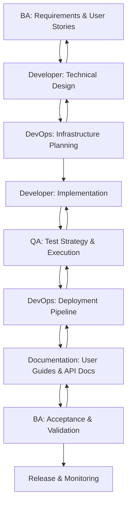

# Cross-Persona Collaboration Workflows

## 🎯 Overview

This guide demonstrates how AI tools can enhance collaboration across different personas in the development lifecycle. Learn to create seamless handoffs, maintain consistency, and leverage AI for cross-functional communication.

## 🔄 Workflow Orchestration

### End-to-End Feature Development Flow



## 👥 Persona Interaction Patterns

### 1. BA → Developer Handoff

#### AI-Assisted Requirements Translation

**BA Prompt:**
```
Convert the following business requirements into technical specifications for developers:

Business Requirements: [REQUIREMENTS]
User Stories: [USER_STORIES]
Acceptance Criteria: [CRITERIA]

Generate:
1. Technical requirements document
2. API specifications needed
3. Data model requirements
4. Integration points
5. Performance requirements
6. Security considerations
7. Developer questions to clarify

Format for developer consumption with technical details.
```

**Developer Response Prompt:**
```
Review the following technical requirements from the BA team:

Technical Requirements: [TECH_REQUIREMENTS]

Provide:
1. Technical feasibility assessment
2. Implementation approach
3. Time estimates
4. Technology stack recommendations
5. Potential risks and challenges
6. Additional questions for the BA
7. Alternative solutions if applicable

Focus on practical implementation considerations.
```

#### Workflow Steps:
1. **BA creates** requirements using AI-generated templates
2. **BA uses AI** to translate business requirements to technical specs
3. **Developer reviews** and provides AI-assisted feasibility analysis
4. **Both collaborate** on refinements using AI for clarification

### 2. Developer → QA Handoff

#### AI-Enhanced Test Strategy Creation

**Developer Prompt:**
```
Based on the following implementation details, create a comprehensive test strategy:

Feature Implementation: [IMPLEMENTATION_DETAILS]
API Endpoints: [ENDPOINT_LIST]
Business Logic: [BUSINESS_RULES]
Integration Points: [INTEGRATIONS]

Generate:
1. Test scenarios covering all functionality
2. Unit test requirements
3. Integration test specifications
4. E2E test scenarios
5. Performance test requirements
6. Security test cases
7. Test data requirements

Format for QA team implementation.
```

**QA Response Prompt:**
```
Review the implementation and create detailed test plans:

Implementation Details: [IMPLEMENTATION]
Test Strategy: [STRATEGY_FROM_DEV]

Generate:
1. Detailed test cases with steps
2. Test automation scripts outline
3. Test data management strategy
4. Environment requirements
5. Risk-based testing approach
6. Regression test suite
7. Performance benchmarks

Include specific test scenarios for edge cases.
```

#### Workflow Steps:
1. **Developer completes** feature implementation
2. **Developer generates** test strategy using AI
3. **QA reviews** and creates detailed test plans with AI
4. **QA implements** tests using AI-generated scripts
5. **Both collaborate** on test results and bug fixes

### 3. DevOps Integration Points

#### AI-Driven Infrastructure and Deployment

**DevOps Prompt for Infrastructure:**
```
Based on the following application requirements, design infrastructure:

Application Architecture: [ARCHITECTURE]
Expected Load: [TRAFFIC_PATTERNS]
Security Requirements: [SECURITY_NEEDS]
Compliance Needs: [COMPLIANCE_REQUIREMENTS]

Generate:
1. Infrastructure architecture
2. Terraform/CloudFormation templates
3. CI/CD pipeline configuration
4. Monitoring and alerting setup
5. Security configurations
6. Backup and disaster recovery
7. Cost optimization recommendations

Include production-ready configurations.
```

**Developer/DevOps Collaboration Prompt:**
```
Optimize application for deployment based on infrastructure constraints:

Application Code: [CODE_STRUCTURE]
Infrastructure Constraints: [CONSTRAINTS]
Performance Requirements: [PERFORMANCE_NEEDS]

Recommend:
1. Code optimization strategies
2. Container configurations
3. Environment-specific settings
4. Logging and monitoring integration
5. Health check implementations
6. Graceful shutdown procedures
7. Configuration management

Focus on production readiness and scalability.
```

### 4. Documentation Integration

#### AI-Powered Documentation Generation

**Documentation Prompt for Technical Writers:**
```
Create comprehensive documentation based on development artifacts:

Source Materials:
- Requirements: [BA_REQUIREMENTS]
- Technical Implementation: [DEV_IMPLEMENTATION]
- Test Results: [QA_RESULTS]
- Deployment Info: [DEVOPS_DEPLOYMENT]

Generate:
1. User documentation and guides
2. API documentation with examples
3. Administrator guides
4. Troubleshooting documentation
5. Release notes
6. Security and compliance docs
7. Integration guides

Ensure consistency across all documentation types.
```

## 🔧 AI-Enhanced Collaboration Tools

### 1. Requirement Consistency Checker

**AI Prompt for Cross-Validation:**
```
Compare and validate consistency across these artifacts:

Business Requirements: [BA_REQUIREMENTS]
Technical Specifications: [DEV_SPECS]
Test Cases: [QA_TESTS]
Documentation: [DOCS]

Identify:
1. Inconsistencies between artifacts
2. Missing requirements coverage
3. Gaps in test coverage
4. Documentation completeness
5. Misaligned expectations
6. Conflicting information
7. Improvement recommendations

Provide specific line-by-line analysis.
```

### 2. Cross-Persona Communication Templates

#### Status Update Template

**AI Prompt:**
```
Generate a status update for cross-functional team:

Persona: [YOUR_ROLE]
Sprint: [SPRINT_NUMBER]
Features: [FEATURE_LIST]
Progress: [CURRENT_STATUS]
Blockers: [IMPEDIMENTS]
Dependencies: [WAITING_ON]

Create:
1. Executive summary
2. Detailed progress by feature
3. Risk assessment
4. Dependency status
5. Next steps
6. Support needed from other teams
7. Timeline updates

Format for stakeholder consumption.
```

### 3. AI-Assisted Code Reviews

#### Cross-Functional Code Review

**AI Prompt for Multi-Perspective Review:**
```
Review this code from multiple persona perspectives:

Code: [CODE_SNIPPET]
Business Requirements: [REQUIREMENTS]

Analyze from perspectives of:
1. Business Analyst: Requirements fulfillment
2. Developer: Code quality and maintainability
3. QA: Testability and edge cases
4. DevOps: Deployability and monitoring
5. Security: Vulnerabilities and compliance
6. Documentation: Code documentation quality

Provide specific feedback for each persona.
```

## 📋 Collaboration Workflows

### Workflow 1: Feature Development Lifecycle

#### Phase 1: Requirements and Planning
1. **BA** creates requirements using AI templates
2. **BA** generates user stories with AI assistance
3. **Developer** reviews and provides technical feasibility with AI
4. **DevOps** assesses infrastructure needs using AI
5. **QA** creates initial test strategy with AI

#### Phase 2: Design and Architecture
1. **Developer** creates technical design with AI
2. **DevOps** designs infrastructure architecture with AI
3. **QA** refines test strategy based on technical design
4. **Documentation** starts planning content structure

#### Phase 3: Implementation
1. **Developer** implements using AI-assisted coding
2. **DevOps** sets up infrastructure using AI-generated configs
3. **QA** creates test automation with AI
4. **Documentation** generates initial drafts with AI

#### Phase 4: Testing and Quality Assurance
1. **QA** executes comprehensive testing with AI support
2. **Developer** fixes issues using AI-assisted debugging
3. **DevOps** validates deployment readiness
4. **BA** validates business requirements fulfillment

#### Phase 5: Deployment and Documentation
1. **DevOps** executes deployment using AI-monitored pipelines
2. **Documentation** finalizes user guides with AI
3. **QA** validates production behavior
4. **BA** confirms business value delivery

### Workflow 2: Bug Triage and Resolution

#### AI-Enhanced Bug Analysis

**Triage Prompt:**
```
Analyze this bug report from multiple perspectives:

Bug Report: [BUG_DESCRIPTION]
Steps to Reproduce: [REPRODUCTION_STEPS]
Expected vs Actual: [BEHAVIOR_COMPARISON]

Provide analysis for:
1. Root cause hypothesis
2. Severity and priority assessment
3. Impact on business requirements
4. Testing gaps that allowed this bug
5. Infrastructure or deployment factors
6. Documentation updates needed
7. Prevention strategies

Assign ownership and next steps.
```

### Workflow 3: Release Planning and Retrospectives

#### AI-Facilitated Retrospectives

**Retrospective Prompt:**
```
Facilitate a cross-functional retrospective:

Sprint Data:
- Features delivered: [FEATURES]
- Velocity: [VELOCITY_METRICS]
- Issues encountered: [PROBLEMS]
- Collaboration effectiveness: [COLLABORATION_FEEDBACK]

Generate:
1. What went well analysis
2. What could be improved
3. Action items by persona
4. Process improvement recommendations
5. Tool and AI usage effectiveness
6. Cross-team communication assessment
7. Next sprint optimization suggestions

Focus on AI-enhanced workflow improvements.
```

## 📊 Collaboration Metrics

### AI-Enhanced Metrics Tracking

**Metrics Analysis Prompt:**
```
Analyze collaboration effectiveness using these metrics:

Metrics Data:
- Requirements change rate: [CHANGE_RATE]
- Developer-QA handoff time: [HANDOFF_TIME]
- Bug escape rate: [ESCAPE_RATE]
- Documentation completeness: [DOC_COMPLETENESS]
- Deployment success rate: [DEPLOYMENT_SUCCESS]

Generate:
1. Collaboration health assessment
2. Bottleneck identification
3. Process improvement opportunities
4. AI tool effectiveness analysis
5. Cross-persona communication quality
6. Predictive insights for next sprint
7. Recommendation prioritization

Include specific improvement actions.
```

## 🎯 Best Practices for AI-Enhanced Collaboration

### 1. Consistent AI Prompting
- Use standardized prompt templates across personas
- Maintain context consistency in AI interactions
- Share effective prompts across team members

### 2. Cross-Persona AI Training
- Regular training sessions on AI tool usage
- Share successful AI interaction patterns
- Establish AI usage guidelines and standards

### 3. AI-Generated Artifact Management
- Version control for AI-generated content
- Clear attribution and review processes
- Regular validation of AI outputs

### 4. Feedback Loops
- Regular assessment of AI collaboration effectiveness
- Continuous improvement of prompts and workflows
- Cross-team sharing of AI best practices

## 🔗 Integration with Development Tools

### GitHub Integration
- AI-assisted pull request reviews
- Automated cross-persona notifications
- AI-generated commit messages and documentation

### Slack/Teams Integration
- AI-powered status updates
- Automated workflow notifications
- Cross-persona communication summaries

### Project Management Integration
- AI-assisted story point estimation
- Automated dependency tracking
- Cross-functional progress reporting

## 📚 Templates and Resources

### Cross-Persona Templates
- [Requirements Handoff Template](../templates/collaboration/requirements-handoff.md)
- [Technical Review Template](../templates/collaboration/technical-review.md)
- [Test Strategy Template](../templates/collaboration/test-strategy.md)
- [Documentation Planning Template](../templates/collaboration/doc-planning.md)

### AI Prompt Libraries
- [Cross-Functional Prompts](../templates/collaboration/cross-functional-prompts.md)
- [Review and Validation Prompts](../templates/collaboration/review-prompts.md)
- [Status and Communication Prompts](../templates/collaboration/communication-prompts.md)

---

**Ready to revolutionize cross-functional collaboration with AI? Start implementing these workflows today! 🚀**