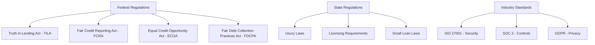

# Lending Regulations Overview for Fintech Applications

## 🎯 Executive Summary

This guide provides a comprehensive overview of key lending regulations that fintech applications must comply with when offering loan products. Understanding these regulations is crucial for developing compliant lending platforms and AI-assisted workflows.

## 🏛️ Regulatory Landscape

### Key Regulatory Bodies

| Regulator | Jurisdiction | Primary Focus |
|-----------|-------------|---------------|
| **CFPB** | United States | Consumer protection, fair lending |
| **OCC** | United States | National bank regulation |
| **FDIC** | United States | Deposit insurance, bank supervision |
| **FCA** | United Kingdom | Financial conduct, consumer protection |
| **APRA** | Australia | Prudential regulation |
| **FINMA** | Switzerland | Financial market supervision |

### Regulatory Framework Overview



## 📋 Core Lending Regulations

### 1. Truth in Lending Act (TILA) / Regulation Z

**Purpose**: Ensure consumers receive clear disclosure of lending terms

**Key Requirements**:

```typescript
interface TILADisclosure {
  // Annual Percentage Rate - must be prominent
  apr: {
    rate: number;
    type: 'FIXED' | 'VARIABLE';
    calculation: string; // How APR is calculated
  };
  
  // Finance charges
  financeCharge: {
    totalAmount: number;
    breakdown: FinanceChargeComponent[];
  };
  
  // Amount financed
  amountFinanced: number;
  
  // Total of payments
  totalPayments: number;
  
  // Payment schedule
  paymentSchedule: PaymentScheduleItem[];
}

class TILAComplianceService {
  
  /**
   * Generate TILA-compliant disclosure
   */
  async generateTILADisclosure(loanTerms: LoanTerms): Promise<TILADisclosure> {
    // Calculate APR using regulation-compliant method
    const apr = await this.calculateAPR(loanTerms);
    
    // Calculate finance charges
    const financeCharge = await this.calculateFinanceCharge(loanTerms);
    
    // Generate payment schedule
    const paymentSchedule = await this.generatePaymentSchedule(loanTerms);
    
    return {
      apr,
      financeCharge,
      amountFinanced: loanTerms.principal,
      totalPayments: paymentSchedule.reduce((sum, payment) => sum + payment.amount, 0),
      paymentSchedule
    };
  }
  
  /**
   * Validate disclosure completeness
   */
  validateDisclosure(disclosure: TILADisclosure): ValidationResult {
    const validations = [
      this.validateAPR(disclosure.apr),
      this.validateFinanceCharge(disclosure.financeCharge),
      this.validatePaymentSchedule(disclosure.paymentSchedule)
    ];
    
    return {
      isValid: validations.every(v => v.isValid),
      errors: validations.flatMap(v => v.errors),
      warnings: validations.flatMap(v => v.warnings)
    };
  }
}
```

### 2. Fair Credit Reporting Act (FCRA)

**Purpose**: Regulate the collection and use of consumer credit information

**Implementation Requirements**:

```typescript
class FCRAComplianceService {
  
  /**
   * Obtain consumer authorization for credit check
   */
  async obtainCreditCheckAuthorization(applicantId: string): Promise<AuthorizationResult> {
    // Generate FCRA-compliant disclosure
    const disclosure = {
      purpose: 'To evaluate your creditworthiness for a loan application',
      consumerRights: [
        'You have the right to know if information in your file has been used against you',
        'You have the right to know what is in your file',
        'You have the right to ask for a credit score',
        'You have the right to dispute incomplete or inaccurate information',
        'Consumer reporting agencies must correct or delete inaccurate, incomplete, or unverifiable information'
      ],
      contactInfo: {
        agency: 'Equifax, Experian, TransUnion',
        disputeProcess: 'Available online or by phone'
      }
    };
    
    // Present disclosure and obtain consent
    const consent = await this.presentDisclosureAndObtainConsent(applicantId, disclosure);
    
    // Log consent for audit purposes
    await this.logConsentForAudit(applicantId, consent, disclosure);
    
    return {
      authorized: consent.granted,
      authorizationId: consent.id,
      timestamp: new Date(),
      disclosure
    };
  }
  
  /**
   * Handle adverse action notices
   */
  async sendAdverseActionNotice(
    applicantId: string, 
    decision: LendingDecision
  ): Promise<void> {
    if (decision.approved) return;
    
    const notice = {
      recipientInfo: await this.getApplicantInfo(applicantId),
      actionTaken: decision.action,
      principalReasons: decision.reasons.slice(0, 4), // Max 4 reasons
      creditScoreInfo: {
        score: decision.creditScore,
        range: '300-850',
        date: decision.scoringDate,
        model: decision.scoringModel
      },
      creditReportingAgency: decision.creditBureau,
      noticeOfRights: this.getFCRANoticeOfRights()
    };
    
    // Send notice within required timeframe (30 days for credit decisions)
    await this.sendNotice(notice, 'ADVERSE_ACTION');
    
    // Log for compliance audit
    await this.logAdvancedNotice(applicantId, notice);
  }
}
```

### 3. Equal Credit Opportunity Act (ECOA)

**Purpose**: Prohibit discrimination in lending

**Compliance Implementation**:

```typescript
class ECOAComplianceService {
  
  // Prohibited basis factors that cannot be used in lending decisions
  private readonly PROHIBITED_FACTORS = [
    'RACE', 'COLOR', 'RELIGION', 'NATIONAL_ORIGIN', 
    'SEX', 'MARITAL_STATUS', 'AGE', 'PUBLIC_ASSISTANCE'
  ];
  
  /**
   * Validate lending criteria for ECOA compliance
   */
  validateLendingCriteria(criteria: LendingCriteria): ECOAValidation {
    const violations = [];
    const warnings = [];
    
    // Check for prohibited factors
    for (const factor of criteria.factors) {
      if (this.PROHIBITED_FACTORS.includes(factor.type)) {
        violations.push({
          factor: factor.type,
          message: `Cannot use ${factor.type} as lending criteria`,
          severity: 'VIOLATION'
        });
      }
    }
    
    // Check for potential disparate impact
    const disparateImpactRisk = await this.assessDisparateImpactRisk(criteria);
    if (disparateImpactRisk.high) {
      warnings.push({
        factor: disparateImpactRisk.factor,
        message: 'Potential disparate impact detected',
        severity: 'WARNING'
      });
    }
    
    return {
      compliant: violations.length === 0,
      violations,
      warnings,
      recommendations: this.generateECOARecommendations(violations, warnings)
    };
  }
  
  /**
   * Monitor for disparate impact in lending decisions
   */
  async monitorDisparateImpact(period: DateRange): Promise<DisparateImpactReport> {
    const applications = await this.getLendingApplications(period);
    
    // Analyze approval rates by protected classes (where legally permissible to track)
    const analysisResults = await this.analyzeApprovalRates(applications);
    
    // Statistical tests for disparate impact
    const statisticalTests = await this.performDisparateImpactTests(analysisResults);
    
    return {
      period,
      totalApplications: applications.length,
      overallApprovalRate: analysisResults.overall.approvalRate,
      statisticalResults: statisticalTests,
      riskLevel: this.assessDisparateImpactRisk(statisticalTests),
      recommendations: this.generateImpactRecommendations(statisticalTests)
    };
  }
}
```

## 🏦 State-Level Regulations

### Usury Laws and Interest Rate Caps

```typescript
class UsuroLawCompliance {
  
  // State-specific interest rate caps
  private readonly STATE_RATE_CAPS: Record<string, RateCap> = {
    'NY': { max: 16, type: 'SIMPLE', exceptions: ['LICENSED_LENDER'] },
    'CA': { max: 10, type: 'SIMPLE', unlicensed: 7 },
    'TX': { max: 18, type: 'SIMPLE', structured: true },
    'FL': { max: 18, type: 'SIMPLE', over1000: 30 },
    // ... other states
  };
  
  /**
   * Validate interest rate compliance
   */
  validateInterestRate(loanTerms: LoanTerms, borrowerState: string): RateValidation {
    const stateCap = this.STATE_RATE_CAPS[borrowerState];
    if (!stateCap) {
      return { valid: false, error: 'Unknown state jurisdiction' };
    }
    
    const effectiveRate = this.calculateEffectiveRate(loanTerms);
    const applicableCap = this.determineApplicableCap(stateCap, loanTerms);
    
    if (effectiveRate > applicableCap) {
      return {
        valid: false,
        error: `Rate ${effectiveRate}% exceeds ${borrowerState} cap of ${applicableCap}%`,
        suggestedRate: applicableCap
      };
    }
    
    return { valid: true, effectiveRate, applicableCap };
  }
  
  /**
   * Calculate all-in rate including fees
   */
  private calculateEffectiveRate(loanTerms: LoanTerms): number {
    const totalCost = loanTerms.principal * loanTerms.interestRate + 
                     loanTerms.fees.reduce((sum, fee) => sum + fee.amount, 0);
    
    return (totalCost / loanTerms.principal) * (365 / loanTerms.termDays) * 100;
  }
}
```

### Licensing Requirements

```typescript
class LendingLicenseCompliance {
  
  /**
   * Check licensing requirements by state and loan type
   */
  async checkLicensingRequirements(
    loanType: LoanType, 
    operatingStates: string[]
  ): Promise<LicensingRequirement[]> {
    const requirements = [];
    
    for (const state of operatingStates) {
      const stateReqs = await this.getStateLicensingRequirements(state, loanType);
      requirements.push({
        state,
        required: stateReqs.licenseRequired,
        licenseType: stateReqs.licenseType,
        minimumNetWorth: stateReqs.minimumNetWorth,
        bondRequirement: stateReqs.bondRequirement,
        applicationFee: stateReqs.applicationFee,
        renewalFrequency: stateReqs.renewalFrequency
      });
    }
    
    return requirements;
  }
  
  /**
   * Monitor license compliance status
   */
  async monitorLicenseCompliance(): Promise<ComplianceStatus> {
    const licenses = await this.getCurrentLicenses();
    const expiringLicenses = licenses.filter(l => 
      this.daysUntilExpiration(l.expirationDate) <= 90
    );
    
    return {
      totalLicenses: licenses.length,
      activeLicenses: licenses.filter(l => l.status === 'ACTIVE').length,
      expiringLicenses: expiringLicenses.length,
      renewalActions: expiringLicenses.map(l => ({
        state: l.state,
        expirationDate: l.expirationDate,
        renewalDeadline: this.calculateRenewalDeadline(l),
        action: 'RENEW_LICENSE'
      }))
    };
  }
}
```

## 💳 Alternative Lending Regulations

### Online Lending Compliance

```typescript
class OnlineLendingCompliance {
  
  /**
   * Validate online lending disclosure requirements
   */
  validateOnlineDisclosures(disclosures: OnlineDisclosure[]): ValidationResult {
    const requiredDisclosures = [
      'LOAN_TERMS',
      'APR_CALCULATION',
      'PAYMENT_SCHEDULE',
      'DEFAULT_CONSEQUENCES',
      'RIGHT_TO_CANCEL',
      'CONTACT_INFORMATION',
      'COMPLAINT_PROCESS'
    ];
    
    const missing = requiredDisclosures.filter(required => 
      !disclosures.some(d => d.type === required)
    );
    
    // Check prominence and timing requirements
    const prominenceIssues = disclosures.filter(d => 
      !this.meetsProminenceRequirements(d)
    );
    
    return {
      compliant: missing.length === 0 && prominenceIssues.length === 0,
      missingDisclosures: missing,
      prominenceIssues,
      recommendations: this.generateDisclosureRecommendations(missing, prominenceIssues)
    };
  }
  
  /**
   * Implement cooling-off period for online loans
   */
  async implementCoolingOffPeriod(loanApplication: LoanApplication): Promise<CoolingOffResult> {
    const coolingOffHours = this.getCoolingOffRequirement(
      loanApplication.borrowerState,
      loanApplication.loanAmount
    );
    
    if (coolingOffHours > 0) {
      const coolingOffEnd = new Date(
        loanApplication.submissionTime.getTime() + 
        (coolingOffHours * 60 * 60 * 1000)
      );
      
      await this.scheduleCoolingOffNotification(loanApplication.id, coolingOffEnd);
      
      return {
        required: true,
        coolingOffPeriod: coolingOffHours,
        availableAt: coolingOffEnd,
        canProceed: new Date() >= coolingOffEnd
      };
    }
    
    return { required: false, canProceed: true };
  }
}
```

### Small Dollar Lending (Payday Loan Alternatives)

```typescript
class SmallDollarLendingCompliance {
  
  /**
   * Validate small dollar loan terms against CFPB guidelines
   */
  validateSmallDollarLoan(loanTerms: SmallDollarLoanTerms): ValidationResult {
    const violations = [];
    
    // Principal amount limits
    if (loanTerms.principal > 1000) {
      violations.push('Principal exceeds small dollar loan limit of $1,000');
    }
    
    // Term length requirements
    if (loanTerms.termDays < 45) {
      violations.push('Term must be at least 45 days for small dollar loans');
    }
    
    // Payment limitations (no more than 5% of gross income)
    const maxPayment = loanTerms.borrowerIncome * 0.05;
    if (loanTerms.paymentAmount > maxPayment) {
      violations.push(`Payment amount ${loanTerms.paymentAmount} exceeds 5% of income limit`);
    }
    
    // APR limitations (varies by state)
    const aprLimit = this.getSmallDollarAPRLimit(loanTerms.borrowerState);
    if (loanTerms.apr > aprLimit) {
      violations.push(`APR ${loanTerms.apr}% exceeds state limit of ${aprLimit}%`);
    }
    
    return {
      compliant: violations.length === 0,
      violations,
      recommendations: this.generateSmallDollarRecommendations(violations)
    };
  }
}
```

## 🤖 AI-Assisted Compliance Monitoring

### Automated Regulation Tracking

```typescript
class RegulatoryChangeMonitor {
  
  /**
   * Monitor regulatory changes using AI-powered news analysis
   */
  async monitorRegulatoryChanges(): Promise<RegulatoryUpdate[]> {
    // Fetch regulatory news from multiple sources
    const newsSources = [
      'cfpb.gov',
      'federalregister.gov',
      'occ.gov',
      'fdic.gov'
    ];
    
    const updates = [];
    
    for (const source of newsSources) {
      const articles = await this.fetchRegulatoryNews(source, '30 days');
      const analyzedUpdates = await this.analyzeRegulatoryImpact(articles);
      updates.push(...analyzedUpdates);
    }
    
    // Use AI to categorize and prioritize updates
    const prioritizedUpdates = await this.prioritizeUpdates(updates);
    
    // Generate compliance action items
    const actionItems = await this.generateComplianceActions(prioritizedUpdates);
    
    return prioritizedUpdates.map(update => ({
      ...update,
      actionItems: actionItems.filter(a => a.updateId === update.id)
    }));
  }
  
  /**
   * AI-powered compliance gap analysis
   */
  async analyzeComplianceGaps(): Promise<ComplianceGapAnalysis> {
    // Analyze current policies and procedures
    const currentCompliance = await this.getCurrentComplianceStatus();
    
    // Compare against regulatory requirements
    const requirements = await this.getAllRegulatoryRequirements();
    
    // Use AI to identify gaps
    const gaps = await this.identifyComplianceGaps(currentCompliance, requirements);
    
    // Generate remediation plan
    const remediationPlan = await this.generateRemediationPlan(gaps);
    
    return {
      overallScore: this.calculateComplianceScore(gaps),
      identifiedGaps: gaps,
      remediationPlan,
      estimatedCost: this.estimateRemediationCost(remediationPlan),
      timeline: this.estimateRemediationTimeline(remediationPlan)
    };
  }
}
```

### Intelligent Document Generation

```typescript
class AIDocumentGenerator {
  
  /**
   * Generate compliance documents using AI
   */
  async generateComplianceDocument(
    documentType: ComplianceDocumentType,
    parameters: DocumentParameters
  ): Promise<GeneratedDocument> {
    
    const template = await this.getDocumentTemplate(documentType);
    const regulatoryRequirements = await this.getRegulatoryRequirements(documentType);
    
    // Use AI to generate document content
    const generatedContent = await this.aiService.generateDocument({
      template,
      requirements: regulatoryRequirements,
      parameters,
      style: 'REGULATORY_COMPLIANT',
      tone: 'FORMAL'
    });
    
    // Validate generated document
    const validation = await this.validateDocumentCompliance(
      generatedContent, 
      regulatoryRequirements
    );
    
    if (!validation.compliant) {
      // Iterate with AI to fix compliance issues
      const improvedContent = await this.improveDocumentCompliance(
        generatedContent,
        validation.issues
      );
      
      return {
        content: improvedContent,
        validation: await this.validateDocumentCompliance(improvedContent, regulatoryRequirements),
        metadata: {
          generatedAt: new Date(),
          aiModel: 'gpt-4',
          iterations: 2
        }
      };
    }
    
    return {
      content: generatedContent,
      validation,
      metadata: {
        generatedAt: new Date(),
        aiModel: 'gpt-4',
        iterations: 1
      }
    };
  }
}
```

## 📊 Compliance Testing and Validation

### Automated Compliance Testing

```typescript
describe('Lending Regulation Compliance Tests', () => {
  
  describe('TILA Compliance', () => {
    it('should generate accurate APR disclosures', async () => {
      const loanTerms = {
        principal: 10000,
        interestRate: 0.12,
        termMonths: 36,
        fees: [{ type: 'ORIGINATION', amount: 300 }]
      };
      
      const disclosure = await tilaService.generateTILADisclosure(loanTerms);
      
      expect(disclosure.apr.rate).toBeCloseTo(13.16, 2);
      expect(disclosure.totalPayments).toBe(13140);
      expect(disclosure.financeCharge.totalAmount).toBe(3140);
    });
    
    it('should validate required disclosure elements', async () => {
      const incompleteDisclosure = {
        apr: { rate: 12.5, type: 'FIXED' },
        // Missing required elements
      };
      
      const validation = tilaService.validateDisclosure(incompleteDisclosure);
      
      expect(validation.isValid).toBe(false);
      expect(validation.errors).toContain('Missing finance charge disclosure');
      expect(validation.errors).toContain('Missing payment schedule');
    });
  });
  
  describe('ECOA Compliance', () => {
    it('should reject prohibited factors in lending criteria', async () => {
      const criteriaWithProhibitedFactors = {
        factors: [
          { type: 'CREDIT_SCORE', weight: 0.4 },
          { type: 'INCOME', weight: 0.3 },
          { type: 'RACE', weight: 0.1 }, // Prohibited!
          { type: 'AGE', weight: 0.2 }   // Prohibited!
        ]
      };
      
      const validation = ecoaService.validateLendingCriteria(criteriaWithProhibitedFactors);
      
      expect(validation.compliant).toBe(false);
      expect(validation.violations).toHaveLength(2);
      expect(validation.violations[0].factor).toBe('RACE');
      expect(validation.violations[1].factor).toBe('AGE');
    });
  });
  
  describe('State Usury Law Compliance', () => {
    it('should enforce New York interest rate caps', async () => {
      const highRateLoan = {
        principal: 5000,
        interestRate: 0.20, // 20% exceeds NY cap
        termDays: 365,
        fees: []
      };
      
      const validation = usoryService.validateInterestRate(highRateLoan, 'NY');
      
      expect(validation.valid).toBe(false);
      expect(validation.error).toContain('exceeds NY cap of 16%');
      expect(validation.suggestedRate).toBe(16);
    });
  });
});
```

## 📋 Compliance Checklist

### Pre-Launch Regulatory Review

- [ ] **Federal Compliance**
  - [ ] TILA disclosures implemented and tested
  - [ ] FCRA authorization and adverse action procedures
  - [ ] ECOA non-discrimination controls
  - [ ] FDCPA debt collection compliance (if applicable)

- [ ] **State Compliance**
  - [ ] Interest rate caps validated for all operating states
  - [ ] Licensing requirements met
  - [ ] State-specific disclosure requirements
  - [ ] Small loan law compliance

- [ ] **Operational Compliance**
  - [ ] Automated compliance monitoring
  - [ ] Staff training on regulatory requirements
  - [ ] Audit trail and documentation systems
  - [ ] Complaint handling procedures

- [ ] **Technology Compliance**
  - [ ] AI model bias testing and monitoring
  - [ ] Data privacy and security controls
  - [ ] Regulatory change monitoring systems
  - [ ] Automated document generation validation

## 🚨 Regulatory Risk Management

### Risk Assessment Framework

```typescript
class RegulatoryRiskAssessment {
  
  async assessRegulatoryRisk(): Promise<RiskAssessment> {
    const riskFactors = [
      await this.assessComplianceGapRisk(),
      await this.assessRegulatoryChangeRisk(),
      await this.assessEnforcementRisk(),
      await this.assessReputationalRisk()
    ];
    
    const overallRisk = this.calculateOverallRisk(riskFactors);
    const mitigationPlan = await this.generateMitigationPlan(riskFactors);
    
    return {
      overallRiskLevel: overallRisk.level,
      riskScore: overallRisk.score,
      riskFactors,
      mitigationPlan,
      nextAssessmentDate: this.calculateNextAssessmentDate(overallRisk.level)
    };
  }
}
```

## 📚 Resources and References

### Regulatory Resources

- [CFPB Compliance Guides](https://www.consumerfinance.gov/compliance/)
- [Federal Register - Financial Services](https://www.federalregister.gov/)
- [OCC Interpretive Letters](https://www.occ.gov/topics/laws-and-regulations/interpretations-and-actions/interpretive-letters/index-interpretive-letters.html)
- [State Banking Departments Directory](https://www.csbs.org/regulatory-resources)

### Industry Associations

- Consumer Financial Services Association (CFSA)
- Online Lending Policy Institute (OLPI)
- Marketplace Lending Association (MLA)
- American Financial Services Association (AFSA)

---

*This guide is part of the comprehensive AI-driven development course. For implementation examples, see the [sample application](../../sample-app/README.md).*